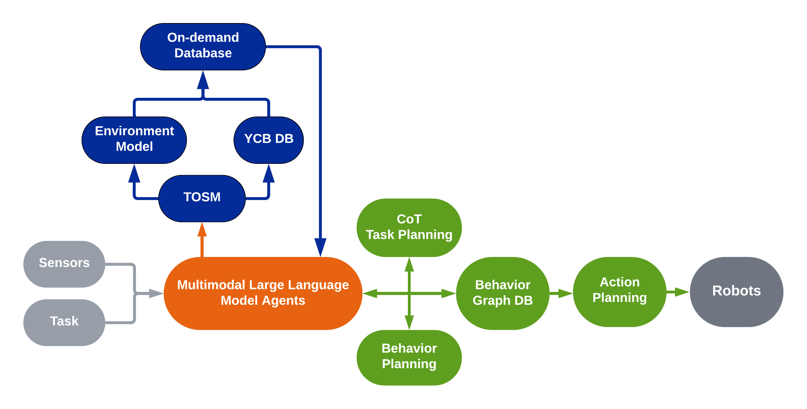

# 🌎 neurosymbolic-vla

**Neurosymbolic Vision-Language-Action architecture grounded in a Semantic World Model. Independent open-source reimplementation. In development.**

[](LICENSE)
[]()
[]()

---

> ⚠️ **Important Notice — Intellectual Property & Independent Reimplementation**
>
> The architecture described in this repository is conceptually derived from academic research conducted during a master's thesis at Sungkyunkwan University (SKKU), 2024 [1][2]. The original software implementation developed during that research was produced under a sponsored research agreement and is subject to intellectual property restrictions held by the industrial sponsor.
>
> **This repository is a fully independent reimplementation** written from scratch, with no reuse of any proprietary source code. It is inspired by the same architectural philosophy and published academic findings, which are freely citable under standard academic fair use. The goal is to make the core ideas accessible to the open robotics and AI community in a legally clean form.
>
> If you are the original rights holder and have any concerns, please open an issue or contact the author directly.

---

## Overview

**neurosymbolic-vla** is an open-source cognitive control architecture for robotic manipulation that unifies structured symbolic knowledge representation with modern Vision-Language-Action (VLA) foundation models. The system bridges classical ontological reasoning — historically effective for deterministic task planning and safety guarantees — with the generalization power of large-scale multimodal transformers.

**Primary test platform: dual-arm [SO-ARM101](https://github.com/TheRobotStudio/SO-ARM100) setup emulating a microfactory environment for multipurpose assembly tasks.** The dual-arm configuration introduces bimanual coordination, object handoff, and sequential assembly reasoning — directly exercising the long-horizon planning capabilities of the GraSP orchestrator and the semantic grounding of the OSKR layer.

The architecture addresses a fundamental limitation of both paradigms in isolation:

- **Pure symbolic systems** (ontology + PDDL planners) are interpretable and safe but brittle, requiring exhaustive manual domain engineering and failing in stochastic open-world environments.
- **Pure neural VLAs** generalize well and require no manual domain coding but lack explicit task-level interpretability and struggle with long-horizon planning.

This work proposes a hybrid: structured **Ontological Semantic Knowledge Representation (OSKR)** feeding a **Graph-based Symbolic Planning (GraSP)** orchestrator [9] that coordinates low-level **VLA policies** grounded in a **Semantic World Model (SWM)** [6].

<div align="center">
  
  <br><em>Neurosymbolic VLA architecture — OSKR knowledge representation → GraSP orchestrator → VLA policy execution grounded in a Semantic World Model.</em>
</div>

---

## Architectural Foundations

### 1. Ontological Semantic Knowledge Representation (OSKR)

The world model is structured as a three-layer ontological knowledge graph inspired by neuro-cognitive modeling principles [1][3][4]. Each entity in the environment — objects, places, agents — is defined across three complementary layers:

| Layer | Description | Examples |
|---|---|---|
| **Explicit** | Directly observable, metrically grounded properties | Pose `[x,y,z,qx,qy,qz,qw]`, bounding box `[l,w,h]`, RGB color |
| **Implicit** | Inferred relational and physical properties | `isMovable`, `accessibilityLevel`, `spatialRelation`, `canBeAccessed` |
| **Symbolic** | Human-readable semantic identifiers | Object names, place labels, unique IDs for LLM grounding |

This three-layer structure directly resolves the **semantic grounding problem** [1]: anchoring abstract natural language instructions into the physical constraints of the real world. The explicit layer grounds metric constraints, the implicit layer encodes inferred physics and topology, and the symbolic layer interfaces with the token vocabulary of foundation models.

#### OSKR Schema Reference

Each entity (Place or Object) is formally defined across the three layers. The tables below specify the full property schema.

**Place entity schema:**

| Layer | Property | Type | Description |
|---|---|---|---|
| Symbolic | `placeID` | Integer | Unique identifier for the space |
| Symbolic | `name` | String | Human-readable label |
| Explicit | `coordinateFrame` | String | Reference map coordinate system |
| Explicit | `boundary` | Polygon | Array of 3D spatial limits |
| Implicit | `canBeAccessed` | Boolean | Navigation constraint flag |
| Implicit | `floorType` | String | Surface type — dictates locomotion/action strategy |
| Implicit | `purpose` | String | Semantic function of the space |
| Implicit | `includingObjects` | Array | List of object IDs contained within |
| Implicit | `spatialRelations` | Array | Topological relations, e.g., `isConnectedTo` |

**Object entity schema:**

| Layer | Property | Type | Description |
|---|---|---|---|
| Symbolic | `objectID` | Integer | Unique identifier for the object |
| Symbolic | `name` | String | Human-readable label |
| Explicit | `coordinateFrame` | String | Reference map coordinate system |
| Explicit | `size` | Array | Bounding box dimensions `[l, w, h]` |
| Explicit | `pose` | Array | `[x, y, z, qx, qy, qz, qw]` |
| Explicit | `color` | Array | `[r, g, b]` |
| Implicit | `purpose` | String | Semantic function |
| Implicit | `isKeyObject` | Boolean | Navigation / localization landmark |
| Implicit | `accessibilityLevel` | Float | 0.0 (inaccessible) → 1.0 (fully accessible) |
| Implicit | `spatialRelation` | Array | e.g., `isInsideOf`, `isOnTopOf` |

#### Instantiated Example — Dual-Arm Microfactory Scene

The following shows a concrete OSKR instantiation for a microfactory assembly workspace with the SO-ARM101 dual-arm setup. Objects are assembly-relevant components typical of a multipurpose tabletop manufacturing cell.

```json
{
  "places": [
    {
      "symbolic": {
        "placeID": 1,
        "name": "assembly_station"
      },
      "explicit": {
        "coordinateFrame": "world",
        "boundary": [[0.0, 0.0, 0.0], [0.8, 0.0, 0.0], [0.8, 0.6, 0.0], [0.0, 0.6, 0.0]]
      },
      "implicit": {
        "canBeAccessed": true,
        "floorType": "flat_tabletop",
        "purpose": "bimanual_component_assembly",
        "includingObjects": [1, 2, 3, 4],
        "spatialRelations": [
          {"isConnectedTo": "component_tray"},
          {"isNextTo": "inspection_station"}
        ]
      }
    },
    {
      "symbolic": {
        "placeID": 2,
        "name": "component_tray"
      },
      "explicit": {
        "coordinateFrame": "world",
        "boundary": [[0.85, 0.0, 0.0], [1.2, 0.0, 0.0], [1.2, 0.6, 0.0], [0.85, 0.6, 0.0]]
      },
      "implicit": {
        "canBeAccessed": true,
        "floorType": "flat_tabletop",
        "purpose": "parts_storage_and_staging",
        "includingObjects": [5, 6, 7],
        "spatialRelations": [
          {"isConnectedTo": "assembly_station"}
        ]
      }
    }
  ],

  "objects": [
    {
      "symbolic": {
        "objectID": 1,
        "name": "pcb_board"
      },
      "explicit": {
        "coordinateFrame": "world",
        "size": [0.10, 0.07, 0.002],
        "pose": [0.35, 0.30, 0.01, 0.0, 0.0, 0.0, 1.0],
        "color": [0, 102, 0]
      },
      "implicit": {
        "purpose": "assembly_base_component",
        "isKeyObject": true,
        "accessibilityLevel": 0.95,
        "spatialRelation": [{"isOnTopOf": "assembly_station"}],
        "isMovable": true,
        "isFragile": true,
        "graspStrategy": "flat_pinch"
      }
    },
    {
      "symbolic": {
        "objectID": 2,
        "name": "m3_hex_bolt"
      },
      "explicit": {
        "coordinateFrame": "world",
        "size": [0.006, 0.006, 0.012],
        "pose": [0.42, 0.28, 0.01, 0.0, 0.0, 0.0, 1.0],
        "color": [192, 192, 192]
      },
      "implicit": {
        "purpose": "fastener_for_bracket_assembly",
        "isKeyObject": false,
        "accessibilityLevel": 0.6,
        "spatialRelation": [{"isNextTo": "pcb_board"}],
        "isMovable": true,
        "isFragile": false,
        "graspStrategy": "precision_pinch"
      }
    },
    {
      "symbolic": {
        "objectID": 3,
        "name": "connector_housing"
      },
      "explicit": {
        "coordinateFrame": "world",
        "size": [0.025, 0.015, 0.018],
        "pose": [0.38, 0.22, 0.01, 0.0, 0.0, 0.0, 1.0],
        "color": [20, 20, 20]
      },
      "implicit": {
        "purpose": "electrical_connector_to_be_pressed_onto_pcb",
        "isKeyObject": false,
        "accessibilityLevel": 0.85,
        "spatialRelation": [{"isNextTo": "pcb_board"}],
        "isMovable": true,
        "isFragile": true,
        "graspStrategy": "lateral_pinch",
        "insertionAxis": "z_negative"
      }
    },
    {
      "symbolic": {
        "objectID": 4,
        "name": "mounting_bracket"
      },
      "explicit": {
        "coordinateFrame": "world",
        "size": [0.06, 0.04, 0.003],
        "pose": [0.30, 0.18, 0.01, 0.0, 0.0, 0.0, 1.0],
        "color": [150, 150, 160]
      },
      "implicit": {
        "purpose": "structural_frame_for_pcb_mounting",
        "isKeyObject": true,
        "accessibilityLevel": 0.90,
        "spatialRelation": [{"isOnTopOf": "assembly_station"}],
        "isMovable": true,
        "isFragile": false,
        "graspStrategy": "flat_pinch",
        "requiresBimanualHandoff": true
      }
    },
    {
      "symbolic": {
        "objectID": 5,
        "name": "wire_harness"
      },
      "explicit": {
        "coordinateFrame": "world",
        "size": [0.15, 0.01, 0.005],
        "pose": [1.00, 0.25, 0.01, 0.0, 0.0, 0.707, 0.707],
        "color": [255, 50, 50]
      },
      "implicit": {
        "purpose": "electrical_interconnect_between_subassemblies",
        "isKeyObject": false,
        "accessibilityLevel": 0.70,
        "spatialRelation": [{"isInsideOf": "component_tray"}],
        "isMovable": true,
        "isFragile": false,
        "isDeformable": true,
        "graspStrategy": "bimanual_coordinated",
        "requiresBimanualHandoff": true
      }
    }
  ]
}
```

> **Note on dual-arm coordination flags:** The `requiresBimanualHandoff` implicit property signals the GraSP orchestrator to dispatch a coordinated sub-goal sequence to both arms simultaneously — a capability not representable in classical single-arm PDDL domains without explicit multi-agent extensions.

In the modern neurosymbolic paradigm [7][8], the OSKR layers transition as follows:

- **Explicit → Multimodal Observation Grounding**: dense visual embeddings from vision encoders replace hand-coded metric databases, enabling real-time latent scene representation.
- **Implicit → Latent World Dynamics**: relational predicates (`isConnectedTo`, `isMovable`) are learned implicitly by fine-tuning VLMs on image-action-text datasets rather than hand-coded as graph edges.
- **Symbolic → VLM Token Space**: semantic identifiers are subsumed into the high-dimensional embedding space of the foundation model.

### 2. Semantic World Model (SWM)

Rather than predicting raw pixel reconstructions of future states — computationally prohibitive and misaligned with planning objectives — the SWM frames world modeling as a **Visual Question Answering (VQA) problem** [6]. Given a current observation $I_t$ and a proposed action sequence $A_{t:t+k}$, the SWM predicts future **task-relevant semantic states** as structured text or Abstract Meaning Representation (AMR) graphs enriched with logical design patterns [8].

This resolves the core failure mode of static ontological databases: the inability to model stochastic outcomes of continuous physical interactions.

### 3. Graph-based Symbolic Planning (GraSP) Orchestrator

Long-horizon task decomposition is handled by a **GraSP-VLA** orchestrator [9] that replaces rigid PDDL planners with a **Multi-Layer Continuous Scene Graph** autonomously generated from SWM observations. The orchestrator:

1. Generates a symbolic representation of the current task from a single demonstration.
2. Automatically extracts PDDL-style action descriptions without manual domain engineering.
3. Decomposes long-horizon tasks into atomic sub-goals, each dispatched to a dedicated low-level VLA policy.
4. Applies an **Implicit Visual Chain-of-Thought (CoT)** [5] to interleave visual reasoning with symbolic task sequencing.

### 4. VLA Policy Execution

Low-level motor execution is handled by VLA policies [5][7] — multimodal transformers ingesting the current visual observation $I_t$ and the current symbolic sub-goal from the GraSP orchestrator, outputting end-effector poses, joint velocities, and gripper states directly to the robot's actuators.

### 5. Neurosymbolic Replanning

At each execution step $t$, the SWM predicts the expected semantic state at $t+1$. The perception module observes the actual state. If the semantic distance between the predicted AMR graph and the observed state exceeds a defined threshold, an anomaly is detected and the GraSP orchestrator performs targeted CoT replanning on the updated scene graph [8].

---

## System Architecture

```
 Natural Language Instruction
           │
           ▼
 ┌─────────────────────────────────────────────────────────────────┐
 │            Ontological Semantic Knowledge Representation         │
 │                          (OSKR Layer)                           │
 │   ┌──────────────┐  ┌──────────────┐  ┌──────────────────────┐ │
 │   │   Explicit   │  │   Implicit   │  │      Symbolic        │ │
 │   │  Observation │  │   Relational │  │   Token Grounding    │ │
 │   │  Grounding   │  │   Physics    │  │  (VLM Token Space)   │ │
 │   └──────┬───────┘  └──────┬───────┘  └──────────┬───────────┘ │
 └──────────┼────────────────┼────────────────────────┼────────────┘
            └────────────────┴────────────────────────┘
                                    │
                                    ▼
 ┌─────────────────────────────────────────────────────────────────┐
 │                  Semantic World Model (SWM)                      │
 │          Future Semantic State Prediction via VQA               │
 │          Multi-Layer Continuous Scene Graph (ML-CSG)            │
 └──────────────────────────────┬──────────────────────────────────┘
                                │
                                ▼
 ┌─────────────────────────────────────────────────────────────────┐
 │            GraSP Neurosymbolic Orchestrator                     │
 │   Visual CoT Reasoning → Sub-goal Decomposition → Policy Dispatch│
 │   Anomaly Detection → Replanning on Scene Graph Update          │
 └──────────────────────────────┬──────────────────────────────────┘
                                │
                                ▼
 ┌─────────────────────────────────────────────────────────────────┐
 │                   VLA Policy Bank                               │
 │   Policy₁: "Pick object"   Policy₂: "Place object"  ...        │
 │   End-effector pose / joint velocity / gripper state output     │
 └──────────────────────────────┬──────────────────────────────────┘
                                │
                                ▼
                         Robot Actuators
```

---

## Prior Work

This architecture is conceptually grounded in the following research:

**Thesis (foundational architecture):**
> G. Galvis Giraldo, "Monolithic Robotics with Cognitive AI: A Compliant Mechanism-Based Anthropomorphic Arm Design for Semantic Autonomous Manipulation," M.S. thesis, Sungkyunkwan University, 2024. [1]

The original cognitive control module introduced a three-layer ontological knowledge representation coupled with LLM-driven task decomposition and PDDL planning for semantic autonomous manipulation. Experimental validation demonstrated successful instruction-following and grasp execution on YCB object sets using Chain-of-Thought (CoT) reasoning and Retrieval-Augmented Generation (RAG).

**Ablation findings from prior work** directly motivate the current architecture:
- Removing the ontological knowledge context from the LLM prompt caused immediate hallucination of spatial relationships and physically impossible action plans — confirming the necessity of structured world grounding.
- Smaller LLMs (e.g., LLaMA 3.2 3B) achieved only 60% task validity in PDDL generation, confirming that text-based plan generation requires high-capacity reasoning models. The current architecture addresses this by replacing text-based PDDL generation with scene-graph-driven orchestration.

---

## Roadmap

### Phase 0 — Architecture & Knowledge Representation
| Component | Status |
|---|---|
| Architecture design | ✅ Done |
| OSKR knowledge graph schema (explicit / implicit / symbolic layers) | 🚧 In progress |
| AMR graph enrichment with logical design patterns | 🚧 In progress |

### Phase 1 — Simulation Environment Setup
| Component | Status |
|---|---|
| Robot asset import — SO-ARM101 dual-arm URDF / USD for Isaac Lab | ⏳ Planned |
| Dual-arm microfactory scene construction in Isaac Lab | ⏳ Planned |
| Bimanual action space and multi-camera observation space definition | ⏳ Planned |
| Teleoperation pipeline for dual-arm demonstration collection | ⏳ Planned |

### Phase 2 — Dataset & Pretraining
| Component | Status |
|---|---|
| Demonstration dataset collection (simulation trajectories) | ⏳ Planned |
| Dataset conversion to LeRobot format | ⏳ Planned |
| Base VLM backbone selection and configuration (e.g., SmolVLM2 / Qwen-VL) | ⏳ Planned |
| Supervised fine-tuning (SFT) on manipulation demonstrations | ⏳ Planned |

### Phase 3 — Neurosymbolic Integration
| Component | Status |
|---|---|
| Semantic World Model (SWM) — VLM fine-tuning for future semantic state prediction | ⏳ Planned |
| SWM — VQA-based state prediction pipeline | ⏳ Planned |
| GraSP orchestrator — Multi-Layer Continuous Scene Graph generation | ⏳ Planned |
| GraSP — Automatic PDDL action extraction from scene graph | ⏳ Planned |
| Implicit Visual Chain-of-Thought (CoT) sub-goal decomposition | ⏳ Planned |
| OSKR grounding ablation study (with vs. without knowledge context) | ⏳ Planned |

### Phase 4 — Closed-Loop Evaluation
| Component | Status |
|---|---|
| Closed-loop bimanual policy evaluation in Isaac Lab (microfactory scene) | ⏳ Planned |
| Benchmarking on standard manipulation suites (LIBERO) | ⏳ Planned |
| Multipurpose assembly task suite evaluation (custom benchmark) | ⏳ Planned |
| Neurosymbolic replanning on anomaly detection | ⏳ Planned |
| Ablation: OSKR grounding vs. no grounding, GraSP vs. end-to-end VLA | ⏳ Planned |

### Phase 5 — Sim-to-Real Transfer
| Component | Status |
|---|---|
| Domain randomization for sim-to-real gap reduction | ⏳ Planned |
| Digital twin construction for target hardware | ⏳ Planned |
| Real-robot deployment and evaluation | ⏳ Planned |

---

## Related Repositories

| Repository | Description |
|---|---|
| [open-yta-hand](https://github.com/yourusername/open-yta-hand) | Monolithic anthropomorphic hand — target end effector |
| [open-kumanday-humanoid](https://github.com/yourusername/open-kumanday-humanoid) | Target full-body platform for VLA deployment |
| [open-huca-skin](https://github.com/yourusername/open-huca-skin) | Tactile skin — force/shape sensing for contact-rich manipulation |
| [SO-ARM101](https://github.com/TheRobotStudio/SO-ARM100) | Dual-arm primary test platform — microfactory assembly setup |

---

## References

[1] G. Galvis Giraldo, "Monolithic Robotics with Cognitive AI: A Compliant Mechanism-Based Anthropomorphic Arm Design for Semantic Autonomous Manipulation," M.S. thesis, Sungkyunkwan University, Suwon, South Korea, 2024.

[2] Y. Jeong, "Semantic-Aware Hierarchical Task Network using LLMs for Home Cleaning Robots," M.S. thesis, Sungkyunkwan University, Suwon, South Korea, 2025.

[3] S.-H. Joo et al., "Autonomous Navigation Framework for Intelligent Robots Based on a Semantic Environment Modeling," *Appl. Sci.*, vol. 10, no. 9, p. 3219, 2020. DOI: 10.3390/app10093219

[4] S. Joo et al., "A Flexible Semantic Ontological Model Framework and Its Application to Robotic Navigation in Large Dynamic Environments," *Electronics*, vol. 11, no. 15, p. 2420, 2022. DOI: 10.3390/electronics11152420

[5] A. Brohan et al., "RT-2: Vision-Language-Action Models Transfer Web Knowledge to Robotic Control," *arXiv preprint arXiv:2307.15818*, 2023. DOI: 10.48550/arXiv.2307.15818

[6] J. Berg et al., "Semantic World Models," *arXiv preprint arXiv:2510.19818*, 2025. DOI: 10.48550/arXiv.2510.19818

[7] S. Sapkota et al., "Vision-Language-Action Model with Open-World Embodied Reasoning," *arXiv preprint*, May 2025. DOI: 10.48550/arXiv.2505.16906

[8] S. De Giorgis et al., "Neurosymbolic Graph Enrichment for Grounded World Models," *Inf. Process. Manage.*, vol. 62, no. 4, p. 104127, Jul. 2025. DOI: 10.1016/j.ipm.2025.104127

[9] M. Neau et al., "GraSP-VLA: Graph-based Symbolic Action Representation for Long-Horizon Planning with VLA Policies," *arXiv preprint arXiv:2511.04357*, Nov. 2025. DOI: 10.48550/arXiv.2511.04357

[10] M. Fox and D. Long, "PDDL2.1: An Extension to PDDL for Expressing Temporal Planning Domains," *J. Artif. Intell. Res.*, vol. 20, pp. 61–124, 2003. DOI: 10.1613/jair.1129

[11] J. Wei et al., "Chain-of-Thought Prompting Elicits Reasoning in Large Language Models," in *Proc. Advances in Neural Information Processing Systems (NeurIPS)*, vol. 35, 2022.

[12] P. Lewis et al., "Retrieval-Augmented Generation for Knowledge-Intensive NLP Tasks," in *Proc. Advances in Neural Information Processing Systems (NeurIPS)*, vol. 33, pp. 9459–9474, 2020.

---

## Author

**Gilberto Galvis Giraldo**
M.Sc. Electrical and Computer Engineering — Sungkyunkwan University

---

## License

Apache License 2.0 — see [LICENSE](LICENSE) for details.

This repository contains no proprietary code from any third party. All implementations are original works of the author released under Apache 2.0.

Apache License 2.0 — see [LICENSE](LICENSE) for details.

This repository contains no proprietary code from any third party. All implementations are original works of the author released under Apache 2.0.
